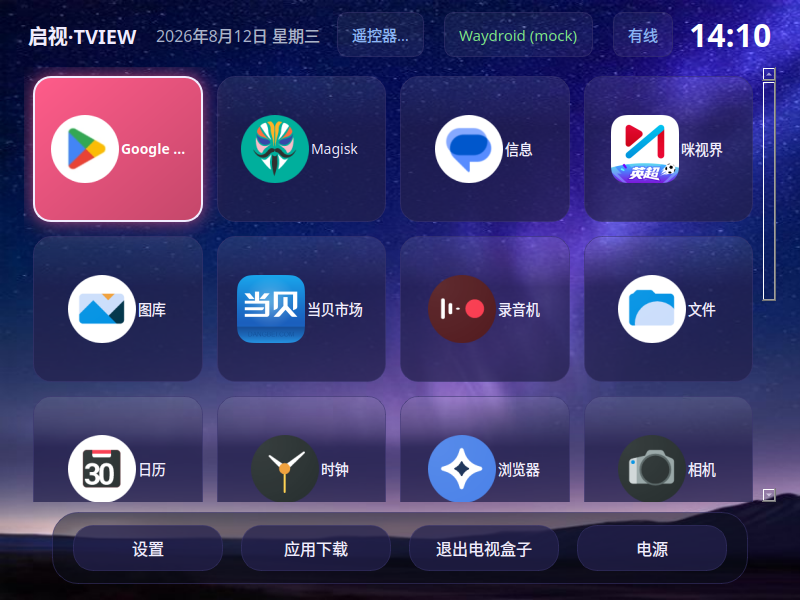
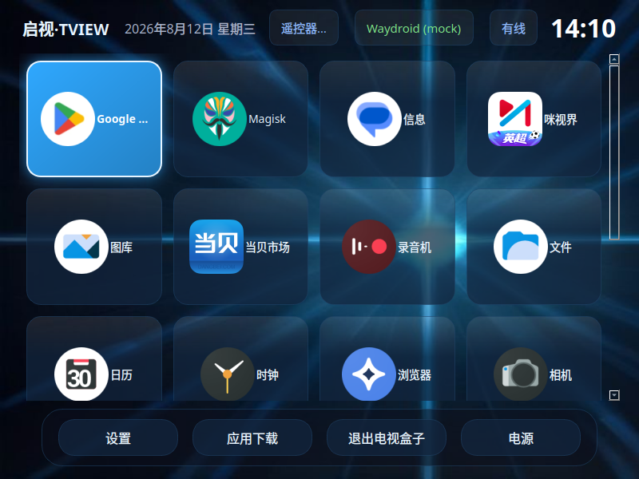

# 启视·TVIEW

**把一台 Ubuntu 电脑变成电视盒子。**

TVIEW 是一个运行在 Ubuntu 上的电视盒子启动器：接上电视和遥控器，普通 x86 电脑（或迷你主机）就变成一台能装安卓 TV 应用的盒子——当贝市场、酷安、B 站 TV 版……想装什么装什么。



## 能做什么

- **🐧 原生 Linux 应用**：设置里手动添加任意 Linux 应用（Kodi、Firefox 等），与安卓应用同网格、遥控器同操作
- **🏠 全屏电视界面**：开机直接进启动器（免密登录），应用网格 + 顶部状态栏（时间/日期/网络）+ 底部导航，遥控器完全操作
- **📱 安卓 TV 生态**：基于 Waydroid 跑安卓系统，ARM-only 应用（当贝/酷安等）通过 libhoudini 转译层运行
- **🎮 遥控器原生支持**：2.4G 遥控器即插即用——返回/主页/菜单/音量在安卓应用里原生生效，方向键/OK 操作界面；按键可自定义映射
- **🎨 多主题界面**：极光/科技蓝/暗星空/明亮等 5 套内置主题 + 自定义配色壁纸，切换即时生效（自动保障对比度）
- **📦 内置应用市场**：F-Droid 一键安装；当贝市场引导下载
- **🌐 中英文界面**，设置里一键切换
- **⚡ 省心集成**：开机自启、看门狗（崩溃自动恢复）、日志导出、重启/关机菜单
- **🔒 安全默认**：退出盒子自动锁屏（需密码进桌面）；设置里可改为免密直退

> 🔒 **关于安全**：开机免密（autologin）只免“进 TVIEW”这一步；退出盒子默认锁屏，桌面操作需密码，防止他人利用免密会话。



## 工作原理（30 秒看懂）

```
Ubuntu ──► TVIEW 启动器（PyQt5 全屏 UI）
   │
   ├─► Waydroid 安卓容器：跑 TV 应用
   │      └─ libhoudini 转译层：x86 机器跑 ARM 应用
   │
   └─► keyd 系统驱动：遥控器键位标准化
          （非标遥控器码 → 标准 Back/Home/Menu/音量键，
            安卓与系统都能原生识别）
```

- **遥控器**：大多数 2.4G 遥控器的返回/主页/音量走"媒体键"通道，普通系统不认识。TVIEW 用 keyd 在系统层把它们标准化成标准键码——所以安卓应用里按返回就是返回，按音量就是音量。
- **安卓应用**：Waydroid 容器内运行完整安卓系统；ARM-only 的 TV 应用由 libhoudini 自动转译（这就是为什么当贝市场这种"只出 ARM 版"的应用也能装能跑）。

## 硬件要求

| 项目 | 要求 |
|---|---|
| 电脑 | x86_64，4GB 内存以上（建议 8GB），建议 i3/同等或以上 |
| 系统 | Ubuntu 24.04 / 26.04 桌面版（全新安装） |
| 电视/显示器 | HDMI 接入 |
| 遥控器 | USB 2.4G 遥控器（推荐）或 USB 键盘 |
| 网络 | 安装时需联网（下载安卓镜像约 2.6GB） |

## 安装

### 1. 准备系统

全新安装 Ubuntu 桌面版（24.04 或 26.04），完成系统初始设置（用户名/密码）。

### 2. 获取 TVIEW

```bash
git clone https://github.com/chimingxu126/tview.git
cd tview
```

### 3. 一键安装

```bash
sudo bash scripts/install.sh
```

安装器自动完成全部 11 步（约 15-30 分钟，视网络）：

1. 系统层：binder 模块 / 输入设备权限 / sudoers 白名单 / udev 规则
2. 安装 Waydroid（自动匹配你的 Ubuntu 版本）
3. 初始化安卓镜像（自动下载，约 2.6GB）
4. ARM 转译层（libhoudini，见下方引导）
5. 遥控器驱动 keyd（含 TVIEW 键位配置）
6. 部署 TVIEW 本体 + 开机自启
7. 内置应用安装（F-Droid 自动下载安装）
8. 安卓音量初始化（拉满，解决"声音小"）
9. 开机免密（GDM autologin，开机直达 TVIEW）
10. 自启链路检查
11. 自动验收（8 项检查）

> 安装器幂等，任何一步失败修复后重跑即可。

### 4. 两件需要手动获取的事（版权原因）

安装器会引导你完成：

**① ARM 转译层 libhoudini**（不装则安卓 ARM 应用无法运行）——二选一：
- 在线：`bash -c "$(curl -s https://raw.githubusercontent.com/casualsnek/waydroid_script/main/install.sh)"`，菜单选 libhoudini
- 离线：从已有 TVIEW 机器拷贝 `assets/houdini/` 目录，然后 `sudo bash scripts/install.sh --local-assets .`

**② 当贝市场 APK**：到 <https://www.dangbei.com/> 下载，放到 `assets/apks/dangbeimarket.apk`，重跑安装器自动安装。

### 5. 完成

重启电脑 → 自动进入 TVIEW。搞定。

## 遥控器按键

| 按键 | 功能 |
|---|---|
| 方向键 / OK | 移动焦点 / 确认 |
| 返回 | 返回 / 退出应用 |
| 主页 | 回主页（TVIEW 或安卓桌面） |
| 菜单 | 应用菜单 |
| 音量 +/− | 系统音量（安卓内也生效） |
| 设置键 | 打开设置 |
| 长按返回 3 秒 | 从安卓应用回 TVIEW |

## 从源码运行 / 构建

```bash
sudo apt install -y python3-pyqt5 python3-evdev python3-yaml
python3 main.py --mock    # 模拟模式（无硬件可试）
python3 main.py --prod    # 生产模式

# 打包单文件二进制
pip install pyinstaller
pyinstaller --clean -y tview.spec    # 产物 dist/tview
```

## 已知问题

- 长按返回 3 秒在安卓应用聚焦时不生效（安卓返回键本身可用，简化处理）
- Waydroid "启动"按钮在 GNOME 桌面环境可能失败，盒子模式（开机免密）下正常
- F-Droid 走 GitHub 直链，国内网络不稳时用内置 APK 或 U 盘安装兜底
- 无 GPU 的虚拟机里安卓桌面可能起不来（真实硬件无此问题）
- IR 红外遥控器暂不支持（需要 lirc 扩展）

## 路线图

- **L2 kiosk 安全模式**（下一版）：TVIEW 专用会话（cage 合成器，无 GNOME 桌面），遥控器为唯一入口；退出盒子回登录界面（要密码）；物理键盘/鼠标无法绕过 TVIEW。安全性和体验最接近真实电视盒子，方案详见 DEVELOPMENT.md §10
- 应用分类、CEC 遥控、蓝牙配对、代理设置、中文输入法
- TVIEW 发行版（Cubic 定制 ISO）

## 许可

MIT，见 [LICENSE](LICENSE)。仓库不包含 libhoudini 与商业 APK 等第三方专有资产，请按安装引导自行获取并遵守其各自许可。

## 开发文档

架构设计与真机实测记录见 [DEVELOPMENT.md](DEVELOPMENT.md)。
